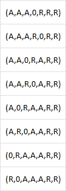

# Naturaleza del entorno

### Ejemplo de pasos de estado (Arriero, puma, lechuga y cabra)

(A,P,C,L)

Estado inicial = estado(i,i,i,i)
Estado deseado = estado(d,d,d,d)

#### Reglas de transición:
El arriero puede cruzar solo, con la cabra, el puma o la lechuga.

### Busqueda a lo ancho
Busca por nivel la respuesta correcta.

### Busqueda a lo profundo
Busca en preorde, primero el hijo izquierdo y luego el derecho (Busqueda en preorden).

# Ejercicio de las 6 ranas

Estado inicial: estado(A,A,A,0,R,R,R)
Estado deseado: estado(R,R,R,0,A,A,A)

### Medidas de rendimiento:
* Deben invertirse el lugar de las ranas que tenían en el estado inicial (Llegar al estado deseado)
* Se deben realizar la menor cantidad de pasos posibles

### Secuencia de percepción:
* Las ranas solo pueden dar un salto, si una rana está bloqueando el salto inmediato entonces no puede saltar, a menos que del lado al que se desea saltar haya un espacio, pero no puede saltar más de 2 nenúfares al mismo tiempo.
* Las ranas saltan de una en una, primero roja, luego azules
* Las ranas no pueden retroceder

### Espacio de estados

# El espacio de estados no da una solución, se requiere tener otra secuencia de percepción

Se quita la necesidad de que sea tiro a tiro