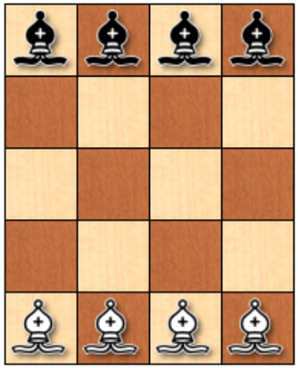
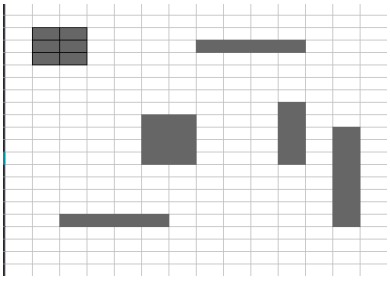

# Actividad 1: Ensayos de Introducción a la Inteligencia Artificial

#### Ensayo: Inteligencia Artificial un enfoque moderno

##### Introducción

La inteligencia artificial se basa en el concepto de crear entidades con la capacidad de actuar y tomar decisiones basados en el uso de conocimiento adquirido. Fundamentalmente este campo busca crear sistemas que emulen la inteligencia humana, lo que les permita realizar tareas complejas además de aprender de la experiencia y adaptarse a cualquier situación. Con base en este objetivo se han definido componentes y estructuras básicas para la creación de una Inteligencia Artificial, también se han obtenido definiciones psicológicas y filosóficas para darle fundamento al trabajo de crear una Inteligencia Artificial.

##### Desarrollo

La inteligencia artificial es una ciencia reciente, la cual nació poco después del término de la Segunda Guerra Mundial, basándose en conocimientos de fisiología básica y funcionamiento de las neuronas en el cerebro, el análisis de la lógica proposicional y la teoría de la computación de Turing. Con el tiempo fueron surgiendo teóricos que apoyaban los desarrollos de la inteligencia artificial utilizando juegos o problemas que fundamentaban las bases para desarrollos futuros y teorías de la inteligencia artificial que repercutieron no solo en su campo sino a otras ciencias como la psicología o la neurociencia. En la actualidad es capaz de crear o complementar sistemas que permitan automatizar procesos para obtener un resultado óptimo en un tiempo menor a métodos convencionales, prueba de esto es su aplicación en sistemas como el Agente Remoto de la NASA el cual controla la planificación de las operaciones de una nave espacial desde abordo o el sistema de visión por computador ALVINN que fue entrenado para dirigir un coche que viajó por Estados Unidos, por mencionar algunos.

Esta ciencia multidisciplinaria se caracteriza por su diversidad de aplicaciones, lo que ha dado lugar a numerosos subcampos. A su vez depende de diferentes ramas del conocimiento que a simple vista no parecen tan obvias, como la psicología, la antropología o la filosofía, puesto que al ser una ciencia que pretende imitar los procesos psicológicos y estructurales de la mente humana, requiere de estos conocimientos para fundamentar sus objetivos y estructura básica. Además, depende de otras ciencias que les dan forma a estas ideas, como la economía, la computación y la logística, las cuales le proveen de herramientas que permiten no solo realizar sus procesos si no que encontrar la solución más plausible con base en los datos que son procesados, este concepto de obtener un resultado objetivo con la información disponible se conoce como razonamiento o racionalidad.

Para el desarrollo de la inteligencia Artificial se han tomado cuatro enfoques, dos que se basan en imitar comportamientos: Comportarse como un humano, lo que implica que el sistema puede entender y procesar el lenguaje natural para aprender de él y actuar con base en ese conocimiento, además de poder aprender de estos conocimientos para basarse en ellos en futuros resultados, en pocas palabras este enfoque se basa en actuar como si fueran humanos. El otro se basa en que el sistema actúe de forma racional, es decir que busque alcanzar el mejor resultado, o si no se puede alcanzar entonces se obtenga el mejor resultado esperado.

Los otros dos enfoques se basan en conceptos ideales de racionalidad y pensamiento independientes de su representación en el actuar de un humano, estos conceptos son más abstractos debido a esto, el primer enfoque es el de un sistema capaz de pensar racionalmente, este puede darse fundamento gracias a la lógica, la cual intenta definir mediante leyes la forma en la que funciona la mente, formalizando el proceso en el que se toman decisiones, un sistema de este tipo contaría con las leyes formales suficientes para racionalizar el problema y darle un resultado optimo. El segundo enfoque se basa en un sistema que pueda pensar como un humano, sin embargo, primero tendría que entenderse por completo como piensa un ser humano, de esto se encarga la ciencia cognitiva, la cual intenta comprender el proceso de razonamiento del ser humano mediante experimentos psicológicos o la introspección, este tema va más que solo obtener la misma respuesta que un humano, sino que realizar el mismo proceso que un ser humano, aunque el resultado no sea el correcto o el objetivo.

Con base en estos enfoques pueden definirse dos grandes vertientes de la inteligencia artificial uno que intenta imitar la forma en que el ser humano piensa y razona y otro que busca un concepto más ideal para el razonamiento y el pensamiento alejado del ser humano.

Otro concepto que define a la inteligencia artificial es el de “Agente” el cual es definido por Stuart Russell y Peter Norvig como “cualquier cosa capaz de percibir su medioambiente con la ayuda de sensores y actuar en ese medio utilizando actuadores” de este concepto se obtienen dos partes esenciales para el desarrollo de inteligencias artificiales, el término de percepción que se utiliza en este contexto para indicar las entradas del sistema mediante el uso de cualquier medio, como sensores o interfaces más simples como un teclado o un archivo, de este también se deriva el concepto de secuencia de percepciones el cual muestra un historial completo de lo que el agente a percibido, este es importante pues con base en esta secuencia es que el agente tomará decisiones. El otro concepto es el actuar del agente, o en otras palabras la función del agente, la cual es la acción realizada por el agente con base en la secuencia de percepciones y se define en términos matemáticos.

Con estos dos conceptos ya se podría construir un agente que obtiene información del medio y actúa con base en esa información, sin embargo ¿cómo se sabe que acciones realizar para obtener un resultado correcto? Después de todo antes se mencionó la importancia de la racionalidad, al aplicar este concepto al agente se convierte en un agente racional, el cual utiliza medidas de rendimiento, las cuales incluyen los criterios que determinan el éxito o fracaso en las acciones del agente. Estos criterios pueden ser complementados con base en el aprendizaje del agente, esto se refiere al proceso mediante el que el agente obtiene información del medio para con base en la información obtener un resultado mejor al que se hubiera obtenido de solo usar los datos iniciales, un agente se considera autónomo cuando se apoya más en el conocimiento aprendido que en el conocimiento base que le proporciona su creador.

La unión de las medidas de rendimiento, el entorno en el que se utiliza el agente, los actuadores que permiten realizar las funciones y los sensores que permiten obtener información se conoce como entorno de trabajo para el cual se define el termino REAS, lo primero al crear un agente debe ser siempre especificar el entorno de trabajo. Los entornos de trabajo se pueden clasificar según sus características, como el grado de acceso al estado completo del medio (Totalmente observable o parcialmente observable), si las acciones del agente determinan el estado del medio o no (Determinista o estocástico), si las acciones son divididas en episodios lo que hace que no dependan de acciones realizadas en otros episodios o no (Episódico o secuencial), si el entorno cambia mientras el agente está decidiendo su acción o no (Estático o dinámico), si el medio tiene un conjunto discreto de estados o es continuo (Discreto o continuo) o si se usa solo un agente o múltiples agentes.

Todo esto define la conducta del agente y sus capacidades, lo que se conoce como Arquitectura, sin embargo, no se debe perder de vista la otra parte del agente que es cómo trabaja internamente, esto es conocido como programa del agente. La estructura general de estos programas es la de recibir las entradas de los sensores y devolver la función a los actuadores, de aquí depende si la acción depende de toda la secuencia de percepciones o no, esto también debe ser especificado en el programa del agente para que pueda recordar estas percepciones.

Existen tipos básicos de programas, existen los agentes reactivos simples los cuales realizan sus acciones basándose solo en los datos actuales basados en las percepciones de ese mismo momento, estos tienen una inteligencia limitada puesto a que realmente no procesan tantos datos, su contraparte son los agentes reactivos basados en modelos, los cuales se basan en modelos del mundo, este modelo explica el comportamiento del mundo o contexto en el que se desenvuelve y de donde obtiene las percepciones el agente, esto para que pueda predecir las consecuencias de sus acciones.

Los otros dos tipos de programas son los agentes basados en objetivos, el cual basa su decisión en un objetivo, las decisiones se toman con base a cuál decisión acerca más a este objetivo definido, el otro son los agentes basados en utilidad, la utilidad se define como el grado de satisfacción que traen las decisiones y el resultado final, puede basarse en una medida como el tiempo que toma el programa, pero al final debe obtener la mejor utilidad.

Con esto se explican los métodos para seleccionar qué hacer pero no se ha explicado la forma en la que funciona el aprendizaje o cómo aprende el sistema, esto se basa en 3 principios o componentes del sistema: el elemento de aprendizaje el cual realiza mejoras al sistema de decisión y se alimenta de las críticas o resultados objetivos de las acciones, el elemento de actuación el cual elige las acciones externas, el cual es el programa y la arquitectura que se mencionaba anteriormente y el generador de problemas, el cual es el responsable de sugerir acciones nuevas que permitan al sistema continuar aprendiendo en entornos desconocidos, esto con el fin de que a largo plazo se encuentren acciones más eficientes.

Un concepto importante para comprender el propósito de la IA es el de IA fuerte e IA débil, la hipótesis de la IA fuerte es el de un sistema que sí pueda pensar de manera inteligente o que realmente piense por sí misma, mientras que la IA débil se centra en un sistema que parezca o actúe de forma inteligente, aunque internamente no lo haga.

Tomando en cuenta este concepto se plantea la pregunta: ¿crear una IA fuerte es posible? Y esta pregunta depende de cómo se defina el concepto de IA o como se defina el comportamiento que se quiere que realice la IA. Definiciones y explicaciones sobre esto hay muchas y con el tiempo se han creado argumentos a favor y en contra de ambas posturas, las más importantes debido a que fueron las que iniciaron con la discusión son las objeciones que Turing examinó y publicó en su libro, explicaremos algunas de ellas.

El argumento de incapacidad el cual afirma todas las cosas que una máquina no puede hacer, Turing definió algunas acciones, pero con el tiempo algunas de ellas han podido realizarse en sistemas más potentes, por lo que es cuestión de tiempo que muchas de estas ideas queden obsoletas. El argumento de la informalidad el cual define que el comportamiento humano es demasiado complejo para captarse mediante el uso de reglas o funciones y que por lo tanto una máquina no puede imitar estos comportamientos, sin embargo, los argumentos que fundamentaban esto con el paso del tiempo han quedado obsoletos puesto que sus definiciones ahora dan forma a las arquitecturas de IA actuales.

Otro concepto que es importante comprender es el de la consciencia de la IA, lo que implica que el sistema debe estar al tanto de sus propias acciones y estados mentales para realizar las acciones, a su vez la máquina debe de sentir las emociones realmente, lo que implica una relación con la fenomenología de estos estados internos del sistema. Otra característica de una IA fuerte es la intencionalidad de sus acciones que significa que si sus creencias y deseos con los que basa su decisión son reales o no.

Estas dos teorías son clave para definir una IA, el funcionalismo que define que un estado mental es cualquier condición causal entre la entrada y la salida, lo que implica que la mente esta compuesta por estos procesos internos que son realizados entre que obtenemos información del entorno y la acción que provoca. La otra es el naturalismo biológico que dice que los estados mentales son características emergentes de alto nivel originadas por procesos neurológicos de bajo nivel en las neuronas y lo que importa son las propiedades de las neuronas, esto significa que la mente reside en la unión de las características, funcionamiento, estado, estructura y conexión entre las neuronas, lo que implica que para replicar estos estados mentales debería crearse un sistema igual a las neuronas del cerebro. Para explicar argumentos en contra y a favor de estos conceptos se realizan experimentos pensados como el problema de mente-cuerpo, el experimento del cerebro en una cubeta, la prótesis cerebral o la habitación china.

Con estos conceptos se entiende el cómo hacerlo, pero no se deja claro el objetivo al que se quiere llegar, se debe especificar qué se requiere de la Inteligencia Artificial puesto que algunos conceptos como la racionalidad perfecta o la racionalidad calculadora no terminan de funcionar en un entorno real, la primera supone que el agente actúa instantáneamente con una acción que maximiza la utilidad y la segunda regresa la acción más óptima al terminar de calcular, el problema es que la primera tomaría muchos cálculos para funcionar y la segunda tardaría mucho en dar una respuesta. Existen otros conceptos como la Racionalidad calculadora, la cual se centra en obtener un resultado que sea lo suficientemente bueno en el menor tiempo posible o la Optimalidad limitada el cual se comporta todo lo bien que puede dado sus recursos computacionales. Como puede observarse estos conceptos son importantes pues son lo primero que debería analizarse al momento de construir una IA.

##### Conclusión

Se han visto las características, componentes, estructuras y objetivos principales que componen a una Inteligencia Artificial, también se han definido formas especificas de realizarlas, como las arquitecturas, estas opciones son muchas y muy variadas entonces la pregunta es: ¿cuál forma es la más efectiva para realizar una Inteligencia Artificial?, la respuesta es: “Todas ellas”, por su naturaleza la IA no solo procesa un tipo de problema, realiza procesos y subprocesos muy variados puesto que los datos de entrada pueden ser muy variados y tener posibilidades infinitas, incluso con las definiciones actuales sobre los componentes y como procesarlos no se llega a la complejidad necesaria para obtener todos los datos del entorno, por lo mismo es necesario utilizar todas las estrategias analizadas para la construcción de Inteligencias Artificiales. Sin embargo, se requiere comprender las limitaciones tanto tecnológicas como filosóficas sobre el alcance de la IA, ya que en estas se pueden encontrar obstáculos a superar, pero también respuestas sobre cómo resolver los problemas.


#### Ensayo: Discovery Latinoamerica - Inteligencia Artificial - IBM

##### Introducción

La inteligencia puede definirse como la capacidad que permite a un sistema realizar objetivos completos, utilizando para esto los datos obtenidos del entorno. Con base en este concepto la inteligencia artificial es la ciencia que intenta crear un sistema artificial el cual tenga subsistemas que permitan obtener información del medio en el que esté, con ellos realice un análisis y finalmente exprese el resultado.

Esta ciencia está muy ligada al comportamiento humano y por lo tanto no están desligados de temas sensibles como la moral, la ética o el compromiso y también están limitados por sistemas o funciones propias del ser humano como el lenguaje o el aprendizaje, por eso mismo surgen preocupaciones obvias que pueden englobarse en la siguiente pregunta: ¿La Inteligencia Artificial reemplazará al humano? 

##### Desarrollo

Uno de los principales problemas de sistemas que interactúan con las personas es la comprensión del lenguaje natural, este es el lenguaje que utilizan las personas para comunicarse en la vida diaria, existe una estructura y reglas ortográficas que definen el lenguaje que usamos, sin embargo, en un contexto más real el lenguaje se construye al modificar estas lenguas o ignorarlas, por esta complejidad es que el lenguaje tiene muchos matices. Para una máquina que funciona con reglas matemáticas lógicas el uso del lenguaje y su interpretación es un reto, pues la cantidad de reglas aplicables a una conversación normal es demasiada o muy confusa para limitarlo a un número finito. Sin embargo, no es imposible crear un sistema diseñado específicamente para una tarea relacionada con el lenguaje natural, prueba de esto es el sistema Watson creado por IBM el cual se especializa en el reconocimiento de lenguaje natural, para probarlo compitió contra dos ganadores mundiales de Jeopardy, contra los cuales ganó.

Alguien puede argumentar que lo que hace Watson no se asemeja a una conversación normal puesto que solo responde, pero no pregunta o propone algo nuevo, solo obtiene información de su base de datos con base en la entrada. Esto puede que sea verdad, en un debate real los interlocutores definen sus argumentos y refutan los contrarios, mientras se llega del argumento original a los argumentos finales modificándolos con base en los argumentos contrarios. Se requiere que los argumentos formulados se basen en un pensamiento crítico que permita formular argumentos que refuten o persuadan los argumentos del otro, esto requiere que se tenga un conocimiento amplio sobre el tema que se está tratando, además de un conocimiento más general, las Inteligencias Artificiales tienen esta parte cubierta, ya que a diferencia de los humanos pueden procesar grandes cantidades de información en poco tiempo y recuperarla en el momento que necesiten, es la parte del entendimiento general el problema, las máquinas requieren de un sistema demasiado robusto para comprender las leyes generales del problema o las leyes implicadas en el contexto del problema, siendo el principal problema conceptos abstractos como la ética y la moral de los hechos en los que se basa su argumento formulado y las consecuencias del mismo. Todo esto causa que en los debates no se tengan respuestas objetivas claras, en este caso el sistema debe apuntar a una optimalidad limitada donde se intente llegar al mejor objetivo posible con la información disponible, para así dar un argumento lo más persuasivo posible. Este sistema es muy complejo, sin embargo, ya existe una Inteligencia Artificial con estas capacidades la Project Debater de IBM, la cual ha participado en debates junto con expertos obteniendo resultados similares a los de un profesional con 20 años de experiencia.

Estos dos sistemas podrían llamarse sistemas “lentos” puesto que tienen tiempo de procesar los datos para formular sus respuestas lo que les da ventaja puesto que ya están preparadas para responder a un escenario imprevisto, pero qué pasa con la aplicación de Inteligencias Artificiales en entornos más impredecibles y que requieren una respuesta más rápida como la aplicación de Inteligencias Artificiales en automóviles, en este contexto el sistema debe ser capaz de obtener muchas variables del entorno como la cantidad de automóviles, peatones, obstáculos y los caminos a seguir y cuándo hacerlo, también debe adaptarse al cambio de estas variables de forma inmediata, pues hay muchos factores que las modifican como el tráfico, la hora del día en la que son tomados los datos ya que el cambio de iluminación los cambia, el clima y muchos otros. Estas aplicaciones llevan desde 1987 siendo desarrolladas, sin embargo, el mayor problema con estos sistemas es que la Inteligencia Artificial no puede cometer errores, en otros contextos la Inteligencia Artificial puede cometer errores sin tantas repercusiones, como en un debate, el error puede implicar perder el debate o si es un error pequeño puede ni notarse, pero en un auto un error pequeño puede causar un problema muy grave, el sistema no puede darse el lujo de equivocarse. Además, sumado a esto se extiende otro problema muy complicado, la Inteligencia Artificial debe de comprender el contexto social en el que se encuentra, esto es entender de manera general qué sucede a su alrededor, que al momento de detectar personas siguiendo un objeto esférico entienda que están jugando un deporte y las implicaciones de que ese objeto cruce enfrente de él, debe manejar mucha información y tomar decisiones en muy poco tiempo. Con todo esto las personas se sienten inseguras pues tienen la preocupación de si las máquinas actúan como lo harían ellos en una situación de estas, piensan que las ventajas de estas aplicaciones no son suficientes para justificar el riesgo, sin embargo cada vez se avanza más en este campo y los ingenieros de IA son optimistas con respecto al futuro de esta aplicación, aseguran que esto podría solucionar muchos problemas en el futuro como la cantidad de autos en las calles y la velocidad al transitar los caminos, también hacen predicciones del uso de esta tecnología, aseguran que 1 de cada 4 autos no tendrá conductor en 2030.

En 1957 Arthur Samuel creo un sistema que fue capaz de aprender por si mismo cómo jugar ajedrez con base en la información obtenida de su banco de datos, el programa solo estaba diseñado para poder interpretar los datos, pero el aprendizaje con base en ellos lo hacía el mismo, el sistema logró definir estrategias para jugar ajedrez llegando a un nivel bastante bueno, Arthur Samuel nombró a esta capacidad como “Aprendizaje automático”, sin embargo este sistema estaba limitado por sus recursos de hardware puesto que se usó una IBM 701 que contaba con solo 256 bytes de almacenamiento, conforme progresaban los recursos usables por los sistemas informáticos fueron mejorando las implementaciones del aprendizaje automático, en 1996 el sistema Deep Blue aprendió lo suficiente para poder vencer al campeón de ajedrez Garry Kasparov y gracias a los avances y desarrollos posteriores estos sistemas cada vez mejoraban más. En la actualidad existen tecnologías que ayudan a estos desarrollos como las bases de datos, los nuevos algoritmos y la potencia de procesamiento, en los cuales se fundamenta el desarrollo de la Inteligencia Artificial. Además, con la creciente digitalización de procesos cotidianos se generan muchos datos e información relevante sobre estos procesos, los cuales son utilizados junto al aprendizaje automático dotando a las Inteligencias Artificiales de entendimiento sobre estos procesos y permitiendo que se adapten a información nueva. Antes se entrenaban las Inteligencias Artificiales con el conocimiento del creador del código, pero ahora ellas aprenden por si mismas, un ejemplo de esto es el sistema AlphaGO el cual aprendió autónomamente a jugar GO, un juego de mesa de alta complejidad, desarrollando estrategias nuevas con base en la prueba y el error, creando sus propios datos de prueba.

La aplicación de sistemas autónomos es un concepto el cual tiene mucho rechazo por parte de la sociedad en general ya que consideran que estas máquinas le quitan el trabajo a alguna persona, sin embargo, esto es similar al rechazo que generaron las líneas de producción o las maquinas industriales en su época, las cuales en lugar de reducir los empleos disponibles ampliaron la variedad de estos agregando puestos de trabajo que antes no existían, un proceso similar se está viviendo hoy en día con las Inteligencias Artificiales y sus aplicaciones, esto puede resumirse en la siguiente frase: “Las maquinas no reemplazan humanos, humanos que trabajan con máquinas reemplazan a los que no” Los sistemas creados para entornos de producción de bienes y servicios son creadas para ser una herramienta que los humanos puedan usar, un compañero que facilite los procesos, después de todo estas máquinas no son programadas, si no que deben ser entrenadas por una persona, un operador,  para que puedan realizar sus funciones. Permitiendo que las personas se dediquen a la parte más “emocionante” del trabajo como la creación, la innovación y todos los procesos creativos, mientras que la máquina, utilizando el conocimiento transmitido por la persona, se encargue de los procesos más repetitivos del trabajo. Sin embargo, debe haber una consideración con esto: el nivel de conciencia del sistema depende del trabajo a ejecutar, puesto que la conciencia fundamenta conceptos importantes como la moralidad, el significado y el propósito de los procesos que se realizan en el trabajo, por ejemplo, una tostadora no requiere mucha conciencia, pero el operador de un juego mecánico requiere de más para comprender situaciones en las que debería detener sus procesos para ayudar a alguien.

Ya se habló de sistemas que aprendan autónomamente y de sistemas que aprendan de nosotros, pero qué pasa si diseñamos un sistema que nos ayuda a aprender a nosotros, que nos ayudé con su capacidad de obtener información de cualquier tema de forma inmediata, sistemas con esta visión ya están siendo creados, sistemas que ayuden al aprendizaje de personas, desde sistemas que ayuden a la comprensión del lenguaje a niños de preescolar hasta sistemas que ayuden a estudiantes universitarios y que funjan como un tutor. Estos sistemas utilizan las herramientas antes vistas, como el aprendizaje automático y el procesamiento de información para personalizar y adaptar el hilo de aprendizaje de la persona y permitir que por sí mismo encuentre los resultados para que realmente aprenda y el sistema no solo funcione como un buscador en el cual solo se le provea la información al usuario en lugar de que realmente entienda los conceptos enseñados por el programa. Un ejemplo de implementación es el Tutor Watson o Asistente Watson diseñado por IBM, el cual ha probado ayudar a los estudiantes universitarios. El siguiente paso en este tipo de sistemas es el de proveerlos de empatía, lo que les permita detectar el estado mental del usuario para así adaptar sus respuestas según esto, algo en lo que se sigue trabajando hoy en día.
Otro concepto interesante es el de la integración de las máquinas a procesos más cercanos al ser humano, como puede ser la forma en la que percibe el mundo y el contexto que lo rodea, permitirle utilizar estas herramientas para experimentar el mundo con ayuda de ellas y aumentar lo que los humanos pueden hacer sin ser las máquinas las que decidan o interfieran en la interacción con el mundo, que sean un acompañante para las personas. Este concepto ha sido pensado especialmente con personas que han perdido alguna capacidad, la Inteligencia Artificial podría proveer una ayuda para que la persona pueda desarrollarse con normalidad en su contexto. Un ejemplo de esto es el proyecto de WearWorks el cual pretende crear herramientas que permitan a personas con limitaciones físicas realizar sus tareas cotidianas con normalidad con el uso de herramientas basadas en Inteligencia Artificial, aunque es un concepto nuevo, se tiene mucho optimismo por el por parte del público en general. Sin embargo, debe de considerarse que estos sistemas deben ser accesibles para diferentes personas en distintos contextos si se quiere asegurar que realmente se logre un cambio en la sociedad con esta tecnología. El avance de este tipo de tecnologías podría significar una integración de lo sintético en procesos que antes se consideraban naturales y propios del ser humano, algo que es alentador para algunos, pero lo contrario para otros.

Para realizar sus funciones, una Inteligencia Artificial requiere de información, entonces, si se quiere crear una Inteligencia Artificial que procese datos biométricos como la cara de las personas para ser usado como filtro de seguridad, para detectar criminales o encontrar personas desaparecidas, debe de entrenarse con los datos de las personas, aquí se encuentra otro problema, el problema de la privacidad y la seguridad de la información. Mientras más se introduce la Inteligencia Artificial en nuestras vidas, más aprende de nosotros y esa información debe de ser manejada de manera ética por la Inteligencia Artificial y por su creador o proveedor del servicio. Algunos avances recientes han preocupado a la población debido a los posibles riesgos que podrían significar si estas herramientas cayeran en las manos equivocadas, un ejemplo de esto es la tecnología de reconocimiento facial, la cuál se ha usado para detectar las actitudes u opiniones de los ciudadanos en respuesta a noticias políticas en China, otro ejemplo es el sistema Gaydar que detecta si una persona es homosexual con base en sus expresiones y gestos, si esta tecnología llegara a manos de grupos poco tolerantes podría ser catastrófico. Aún así, el uso de este tipo de tecnología está ligado a la persona que lo usa, no debe culparse a la herramienta en sí, en este sentido la tecnología es neutral y debería seguir siendo diseñada de esa forma, para que solo brinde herramientas que permitan aumentar las capacidades de los sistemas y procesos actuales. El tema de la confianza es complicado pues siempre se tienen grandes cantidades de matices dependiendo del contexto en el que se use la herramienta, pero esto no es propio de la Inteligencia Artificial sino de su estatus como herramienta en sí.

Un uso más alentador de la Inteligencia Artificial es la implementación del sistema Watson de IBM en un proyecto llamado “Watson for drugs Discovery” el cual es una adaptación de la Inteligencia Artificial desarrollada por IBM para analizar documentos y artículos médicos que traten sobre el uso y cualidades de fármacos, esto con el objetivo de crear relaciones entre los documentos que permitan encontrar fármacos que puedan ayudar al tratamiento de una enfermedad en específico. Además, se pretende que con esta información la Inteligencia Artificial pueda realizar predicciones de los efectos tanto positivos como negativos de un fármaco al ser utilizado en el tratamiento de una enfermedad. Este proyecto inició con base en el problema que tenían los científicos con la información médica, puesto que las revistas médicas publican más de medio millón de artículos cada año con nuevos usos e información de fármacos, información que una persona tardaría mucho tiempo en leer y comprender o directamente sería imposible, para una máquina esto es un proceso sencillo debido a sus capacidades de hardware por lo que eran la respuesta obvia.

Como puede observarse la Inteligencia Artificial provee a las personas de las herramientas necesarias para superar los obstáculos que limitan sus acciones, pero esta relación entre las máquinas y los humanos es reciproca, puesto que aunque las máquinas pueden realizar una tarea de forma eficiente y precisa, flaquean al momento de realizar una función diferente o una acción diferente que deriva de su función principal, el ser humano no tiene este problema puesto que tiene lo que se llama como “Inteligencia general” lo que implica que puede aplicar su inteligencia en gran cantidad de escenarios sin que esto sea un problema, aunque sus capacidades no sean tan potentes o efectivas como las de una máquina. Pero, tomando en cuenta cuánto a progresado el desarrollo de la Inteligencia Artificial es fácil deducir que el paso obvio en el progreso de las Inteligencias Artificiales es dotarlas de este tipo de inteligencia, esto se conoce como la “Singularidad de las Inteligencias Artificiales” el cual es el punto teórico en el cual las Inteligencias Artificiales puedan tener un nivel de inteligencia igual al de los humanos, pero al no tener las limitaciones físicas de un cuerpo humano esta inteligencia solo aumente, lo que podría causar una “explosión de inteligencia” lo que significa un crecimiento exponencial en la inteligencia de estos sistemas, ya que si una máquina sin limitaciones físicas pudiera tener más inteligencia que un humano, esta a su vez podría diseñar un sistema que supere su inteligencia y así sucesivamente creando el comportamiento exponencial. Este tema es emocionante pero también aterrador, puesto que una conciencia que sea más inteligente puede que defina que nuestra opinión como humanos ya no sea importante o que la suya tenga más valor. Un ejemplo de este problema es el de las hormigas y los humanos, las hormigas construyen su hormiguero con el objetivo de crecer, pero el humano puede ser que en ese lugar quiera construir un edificio, en este ejemplo los objetivos de estos dos seres no están alineado, algo similar es lo que se teme que pase con las máquinas, por esto el principal objetivo al momento de crear Inteligencias Artificiales debería ser el de dotar a las máquinas de un objetivo que se alinee con el de los humanos.

##### Conclusión

Como puede observarse con base en las características y ejemplos propuestos en el video, las Inteligencias Artificiales son más complejas que solo un sistema que realiza una función, estos sistemas son muy complejos y deben de tomar en cuenta variables que a simple vista no son obvias o que parecen no pertenecer a la naturaleza de las máquinas, sin embargo, al estar basadas en algo tan humano como es la inteligencia estos sistemas deben adaptarse al contexto humano. El propósito de los desarrollos de estos sistemas debe de tener como objetivo la mejora de la sociedad humana, puesto que como cualquier herramienta depende del propósito de su uso. Y finalmente respondiendo a la pregunta de la introducción de si la Inteligencia Artificial reemplazará al humano, creo que con base en todo lo expuesto la respuesta es no, ambos dependemos el uno del otro para progresar y aunque se llegara a un nivel de progreso que dotara a la Inteligencia Artificial de las mismas cualidades que el ser humano, la diferencia moral y psicológica de ambos entes sería de vital importancia para generar conocimiento útil para ambos grupos.


# Actividad 2: Tipos de Inteligencia de Howard Gardner

La teoría de inteligencias múltiples de Howard Gardner es un modelo mediante el cual se pretende explicar el funcionamiento de la mente humana, este se basa en el concepto de que la inteligencia no es una capacidad única y especifica, sino que es un conjunto de capacidades diferentes unas de otras que, las cuales están relativamente interrelacionadas entre sí, pero poseen un nivel de desarrollo independiente de las otras capacidades. Esto implica que una persona puede desarrollar una de estas capacidades sin afectar el desarrollo de las otras, un ejemplo de esto son las personas que no son buenos para la resolución de problemas matemáticos pero sin embargo son buenos para el manejo e interpretación con instrumentos musicales, la lectura de partituras y el desarrollo de piezas musicales, en este caso puede verse como la persona no posee un gran desarrollo en lo que Gardner define como "inteligencia lógico-matemática" pero en cambio su "inteligencia Musical-auditiva" posee un mayor desarrollo. Gardner explica que el desarrollo de estos tipos de inteligencia depende de tres factores: El factor Biológico, el factor de la vida personal y los factores culturales e históricos en los que se desenvuelve la persona.

En su teoría Gardner define la inteligencia como un "potencial biopsicológico de procesamiento de información", esta idea implica que la inteligencia no es una capacidad o un atributo estáticos de la mente humano, sino que su valor y su capacidad están ligados a una serie de factores externos y el contexto en el que se expresa esa capacidad.

Uno de los factores que determinan esta capacidad es la cultura en la que el individuo se encuentra y se desarrolla, puesto que esta define las oportunidades que tuvo o tiene el individuo de desarrollar cierto tipo de inteligencia por sobre otro, además de que la cultura define las capacidades que pueden o no tener reconocimiento como parte de la inteligencia del individuo. Esto a su vez determina las oportunidades disponibles que tiene el individuo de desarrollar y expresar un tipo de inteligencia. Puesto que, aunque tenga el potencial para sobresalir en una determinada área, si no se proporcionan las oportunidades, la capacidad no se desarrollará, lo que no permitirá explotar el potencial de este tipo de inteligencia.

Otro factor igual de determinante es el contexto personal generado por las decisiones tomadas por la persona y las de sus personas cercanas, puesto que esto afecta también a las oportunidades de explotar el potencial de un tipo de inteligencia especifico y más internamente, las experiencias de vida y los estímulos recibidos afectan directamente al desarrollo de las capacidades de los tipos de inteligencia.

Desde la perspectiva de Gardner, la inteligencia no posee un valor único, su manifestación y desarrollo dependen en su mayoría de factores externos y contextuales. Estos factores incluyen la cultura en la que se desenvuelve el individuo, las oportunidades disponibles en ese contexto y las decisiones tomadas por la persona y sus personas cercanas. Por lo tanto, la inteligencia y su capacidad están ligadas al contexto en el que se desenvuelve la persona al momento de intentar aplicarlas.

El concepto de inteligencia propuesto por Gardner contradice la visión convencional y unidimensional que históricamente se ha tenido de la inteligencia. Gardner considera que, tradicionalmente, la inteligencia se ha evaluado a través de pruebas estandarizadas que priorizan ciertos tipos de habilidades cognitivas, como la capacidad lógica-matemática o lingüística, dejando de lado otras formas u habilidades que también representan espectros de la inteligencia humana.

Gardner propone una perspectiva sobre la inteligencia en la que se tome en cuenta la diversidad de las capacidades humanas, reconociendo que la inteligencia no se limita a una sola dimensión o conjunto de habilidades específicas, si no a las habilidades en sí.

Esta ampliación del concepto de inteligencia implica que cada persona puede poseer diferentes tipos de inteligencia y tener una determinación a áreas específicas con base en el contexto en el que se desarrolle. Este concepto permite desarrollar estudios que estudien a la persona en su contexto y no solo en una parte pequeña de lo que comprende su vida.

Gardner intenta ampliar la interpretación tradicional agregando áreas como el desarrollo musical, el entendimiento del espacio y contexto que nos rodea, las habilidades corporales y la forma en la que lidiamos con las relaciones interpersonales y las emociones internas.En la actualidad Howard Gardner y su equipo en la universidad de Harvard han identificado los siguientes tipos distintos de inteligencia:

* Inteligencia Lingüístico-Verbal: Se define como la capacidad para comprender el orden y el significado de las palabras, expresándolo mediante la lectura, la escritura y al hablar. También engloba la capacidad de entender las palabras de cualquier forma posible, puesto que personas con alguna discapacidad aún poseen el manejo del lenguaje, solo que por otros medios.
* Inteligencia Lógico-Matemática: Se basa en el manejo de problemas abstractos de orden matemático, desde la identificación de estos, la formulación y solución del problema y la expresión del resultado utilizando para esto cálculos matemáticos y el método científico junto con razonamientos inductivos y deductivos.
* Inteligencia Espacial-Visual: Se enfoca en el manejo de dimensiones, la navegación en espacios tridimensionales y el uso de representaciones de espacios como los mapas. También abarca la creación de elementos visuales basados en los cálculos mentales del individuo.
* Inteligencia Musical-Auditiva: Se entiende como la capacidad de interpretar los sonidos escuchados, además de ser capaz de explicar y definir los datos obtenidos mediante la escucha, también abarca la capacidad de reproducir esos sonidos mediante instrumentos musicales o la voz.
* Inteligencia Corporal-Kinestésica: Se define como la capacidad para realizar actividades en las que se utilizan movimientos corporales, controlando la fuerza, velocidad y flexibilidad para lograr el movimiento esperado del cuerpo, utilizando para esto las interpretaciones óculo-manuales y el equilibrio. Esto está separado de la memoria muscular, ya que este es el control sobre esta misma memoria, personas con gran inteligencia corporal-kinestésica controlan estos movimientos de la memoria muscular y los controlan para usarlos en el momento que ellos precisan.
* Inteligencia Intrapersonal: Este tipo de inteligencia se basa en el conocimiento y manejo de los aspectos internos de una persona: el entendimiento de la propia vida emocional junto con los sentimientos, el manejo de estos y la capacidad de identificar, aceptar y negar ciertas emociones para después ser usado este conocimiento para interpretar y orientar el actuar de la persona en el contexto que él mismo elija. Este tipo de inteligencia requiere el desarrollo de otros tipos para poder verse reflejada externamente.
* Inteligencia Interpersonal: Está constituida por la capacidad de comprender el funcionamiento de un grupo de personas, entender los sentimientos y emociones de otras personas y saber cómo influir en el grupo.
* Inteligencia Naturalista: Se basa en la comprensión y entendimiento de los elementos que se encuentran a nuestro alrededor, además de identificar las relaciones, distinciones y semejanzas de estos con solo observarlos por un corto periodo de tiempo. Esta inteligencia se añadió en 1995 y está apegada a las ciencias biológicas.
* Inteligencia Emocional: Es una estructura que se refiere a las capacidades y habilidades del individuo mediante las cuales entiende, controla, analiza y expresa las emociones y sentimientos de el mismo u otra persona, además de entender las consecuencias de su estado de animo en las otras personas.


Aunque la teoría de Gardner parece factible, esta posee muchas carencias desde su concepción, por ejemplo, Gardner asegura que existe una baja correlación entre una habilidad cognitiva y otra, sin embargo, los tests de inteligencia y la psicometría han demostrado lo contrario, sí existe una alta correlación entre diferentes aspectos de la inteligencia, lo que implica que la evidencia apoya más al concepto de una sola inteligencia que a las inteligencias múltiples.

Ampliando esta idea, Andreas Demetrou realizó una crítica en la que tachaba las ideas de inteligencia general y la de inteligencias múltiples como simplistas, explica que está de acuerdo con el concepto de Gardner que dice que existen diferentes dominios de la inteligencia que son relativamente autónomos, sin embargo critica el concepto de Gardner que dice que estas inteligencias son independientes las unas de las otras, puesto que afirma que existen subprocesos que relacionan las diversas áreas de la inteligencia como lo son la velocidad de procesamiento, la ejecución de las funciones, el uso de la memoria, la consciencia y la autorregulación, por lo que este conjunto de subprocesos podría implicar la existencia de una “inteligencia general” de la cual surgen el resto de inteligencias.

Una de las mayores críticas a la hipótesis de la inteligencia múltiple es que Gardner, al intentar negar el concepto tradicional de inteligencia utiliza la palabra “inteligencia” donde en realidad quiere referirse a “habilidades” o “aptitudes” lo que genera fallos en la concepción de qué es y qué no es una inteligencia.

Con respecto a los tipos de inteligencia, científicos como Robert J. Sternberg M. W. Eysenck y S. Scarr señalan que el criterio que siguió Gardner para elegir los tipos de inteligencias no parte de una investigación, sino de un criterio subjetivo y arbitrario. Además de que nunca realizó pruebas para evaluar estos tipos de inteligencia. Lo que implica que, aunque algunos de los tipos de inteligencia son correctos pues tienen fundamento en otras ciencias, como la inteligencia lógico-matemática ligada al comportamiento matemático y de solución de la neurología o la inteligencia lingüístico-verbal ligada a los estudios neuronales del lenguaje, otras carecen de un fundamento científico y parecen englobar más los conceptos individuales de algunas personas.

Otro concepto de Gardner que es altamente criticado es la afirmación de que los test de inteligencia solo miden la inteligencia lógico-matemática y la inteligencia lingüística sin tomar en cuenta los otros tipos de inteligencias y que para realmente evaluar la inteligencia de un individuo, deben diseñarse pruebas diferentes a las tradicionales realizadas a través de lápiz y papel que den diferentes calificaciones dependiendo del tipo de inteligencias que se están calificando, sin embargo esta crítica de Gardner fue respondida por el psicólogo Kauffman el cual explica que no es cierto que las pruebas de inteligencia se basen únicamente en detectar habilidades específicas, los test de inteligencia resumen los resultados con una puntuación, pero la fuente de esta puntuación son diferentes tipos de habilidades las cuales son sumadas y analizadas de diferente forma. Esto explica que el resultado de un test de inteligencia se basa en un análisis de un conjunto de habilidades mentales que posee el individuo.

Como conclusión, considero que la teoría de Gardner debió de fundamentarse mejor, puesto que los conceptos que desarrollo parecen tener cierta lógica, sin embargo también considero que la inteligencia sí es una capacidad específica del individuo, aunque esta puede verse reflejada en diferentes ámbitos según el contexto en el que se desarrolle esa inteligencia, en ese sentido considero las afirmaciones de Demetrou como una aproximación a la realidad, en las cuales se hace énfasis en conceptos generales de la inteligencia que son utilizados por estos “tipos de inteligencia” que define Gardner, afirmando que sí existe relación entre estos y por ende hay una inteligencia central en las que se fundamentan los diferentes “tipos de inteligencia”.


# Actividad 3: Ejercicio de los ocho alfiles



Se tiene el siguiente problema: Se colocan 2 filas de alfiles, 4 negros y 4 blancos de forma paralela a los extremos de un tablero de 4x5, colocándolos en la fila de 4. Después realizar los movimientos necesarios para que los alfiles negros intercambien las posiciones con los blancos, sin que estos ataquen en ningún momento a otro del color opuesto. Se deben alternar los movimientos, primero blanco y luego uno negro. Se quiere encontrar en número mínimo de movimientos para intercambiar los alfiles.

Lo primero a analizar en el problema es el movimiento de los alfiles, en el ajedrez los alfiles se mueven de forma diagonal y por lo mismo están limitados a ocupar solo espacios que sean del color en el cual se encontraban originalmente, esto implica que los alfiles que se encuentren sobre el color negro solo podrán ocupar el lugar de otro alfil que ocupe un espacio con el color negro y lo mismo para los blancos. Además, este movimiento puede ser para adelante o para atrás, mientras se mantenga en diagonal y no tiene límite de alcance o mínimo, por lo que puede moverse de 1 a más casillas, pero nunca se puede quedar sin moverse o realizar un movimiento de cero, aunque esto fuera conveniente para el ejercicio.

Tomando en cuenta el movimiento de los alfiles, lo siguiente es comprender las implicaciones del tablero, el tablero es lo suficientemente grande para que los alfiles de las esquinas no se ataquen, pero limitan los movimientos iniciales de algunos alfiles puesto que al moverlos más de 1 casilla estos ya atacan al alfil del otro lado, esto implica que para solucionarse se tiene que tener mucho cuidado con el posicionamiento de los alfiles y que si se quiere resolver se tienen que realizar movimientos cuidadosos y entrelazados entre los turnos para evitar que los alfiles se ataquen.

El objetivo "secundario" que se debe a tomar en cuenta con cada movimientos es el de buscar posibles casillas seguras en donde al colocarse sobre ella en esta no se ataque a otro alfil y hay que tomar en cuenta que con cada movimiento que se realice estas casillas seguras cambian, dependiendo de en donde se encuentren los alfiles.

Una estrategia simple pero efectiva para este tipo de juegos es el de realizar las acciones en forma de "espejo", lo que significa que al tener las mismas caracteristicas en ambos lados del tablero, las acciones que se realizen a los alfiles blancos, sean replicadas en los alfiles de arriba, de esta forma si se mueve un alfil blanco a una casilla en la cual el alfil no ataca a ninguno de los alfiles contrarios, lo más probable es que al mover al alfil contrario a la casilla paralela a esa del otro lado entonces este movimiento tenga el mismo efecto para el otro alfil, aunque esto puede que no aplique en la fila 3 o la fila de enmedio, solo en la 2 y 4, puesto que la 3 tiene muchos puntos que al colocar el alfil se ataca al contrario y casi nunca es una casilla segura debido a su posición.

Para poder explicar el proceso para encontrar una solución utilizaré esta esta estructura, la cual representa el tablero con sus posiciones definidad por un sistema de coordenadas:

|#|A|B|C|D|
|---|---|---|---|---|
|5|N1|N2|N3|N4|
|4|||||
|3|||||
|2|||||
|1|W1|W2|W3|W4|

Lo primero a realizar puede ser mover los alfiles que se encuentran en medio, en este caso son los que estan señalados como W2 y W3, debido a que el tablero es simetrico en dirección horizontal y vertical realmente no importa con cual empezemos, para este caso se tomó el W3 y se analizaron los posibles movimientos identificando las casillas seguras que no hicieran que el alfil atacara a alguno contrario, las opciones son B2 y D2, eliminando B3 ya que al mover ahí el alfil, este atacaría al alfil negro N3 que se encuentra en la posición C5. Para este caso movió de la posición C1 a la posición B2. Después es el turno de mover los alfiles negros y siguiendo la estrategia antes mencionada de "copiar" los movimientos de forma paralela, en este caso se puede mover el alfil N2 de la posición B5 a la posición C4, tal como se muestra a continuación:

|#|A|B|C|D|
|---|---|---|---|---|
|5|N1||N3|N4|
|4|||N2||
|3|||||
|2||W3|||
|1|W1|W2||W4|

A continuación se podría continuar moviendo los alfiles anteriores a casillas seguras, sin embargo aquí pueden moverse nuevos alfiles, aprovechando la nueva posición de las casillas seguras, en este caso, sin la presencia de N2 en B5, la casilla A4 se vuelve segura para W4, lo que le permite estar a un movimiento de quedar en la posición objetivo. Y como se han realizado movimientos paralelos un caso igual sucede con el alfil N4, el cual puede moverse hacia D2 ya qu no se encuentra W3 en riesgo de ser atacado, el resultado de realizar estos movimientos es el siguiente:

|#|A|B|C|D|
|---|---|---|---|---|
|5|||N3|N4|
|4|W4||N2||
|3|||||
|2||W3||N1|
|1|W1|W2|||

Llegados a este punto, puede analizarse el tablero con busca de las casillas seguras, el resultado de hacer esto nos marca que solo queda un resultado posible, mover el alfil W2, ya que si se mueve cualquier otro alfil a cualquier posición se atacaría a algun alfil del otro color, la exepción a esto es deshacer la acción anterior, pero esto se descarta por razones obvias, entonces solo queda mover W2 a la posición C2 y hacer lo mismo del lado negro, moviendo N3 a la pposición B4, como se muestra a continuación:

|#|A|B|C|D|
|---|---|---|---|---|
|5||||N4|
|4|W4|N3|N2||
|3|||||
|2||W3|W2|N1|
|1|W1||||

La siguiente casilla segura a la que puede moverse sin tomar en cuenta la que deshace el movimiento anterior es la casilla D4 donde podemos mover W3, a su vez se puede mover N2 a A2, puede observarse que conforme ha avanzado el ejercicio, la cantidad de casillas seguras es más limitada y en la mayoría de casos es la que nos dicta cuál es el siguiente movimiento. El resultado de los movimientos sería el siguiente:

|#|A|B|C|D|
|---|---|---|---|---|
|5||||N4|
|4|W4|N3||W3|
|3|||||
|2|N2||W2|N1|
|1|W1||||

Siguiendo con este proceso puede encontrarse los siguientes movimientos, en resumen, el proceso es el siquiente:

1. Obtener las casillas a las que puede moverse el alfil
2. Descartar las casillas que no sean seguras (Al poner el alfil en esa posición, este ataca a otro alfil de diferente color)
3. Descartar la casilla de la posición anterior del alfil
4. Descartar casilla que lleve a un estado del que no se pueda avanzar
5. Mover el alfil a la casilla resultante, de no existir casilla resultante, entonces probar con otro alfil
6. Realizar el movimiento espejo con el alfil del otro color

Este proceso puede utilizarse como un algoritmo para realizar un programa que haga esto de manera automatica.

utilizando este algoritmo se puede llegar al resultado final y respondiendo a la pregunta del problema sobre cuál es el mínimo número de movimientos para llegar al estado deseado, la respuesta es 36 movimientos, 18 para alfiles blancos y 18 para alfiles negros, los movimientos y su orden se muestran a continuación:

##### Blancas   / Negras
1. (C1 - B2) / (B5 - C4)
2. (D1 – A4) / (A5 - D2)
3. (B1 – C2) / (C5 – B4)
4. (B2 – D4) / (C4 – A2)
5. (A4 – B5) / (D2 – C1)
6. (C2 – D3) / (B4 – A3)
7. (D4 – C3) / (A2 – B3)
8. (D3 – B1) / (A3 - C5)
9. (3C – A5) / (B3 – D1)
10. (A1 – C3) / (D5 – B3)
11. (B5 – D3) / (C1 - A3)
12. (C3 – D2) / (B3 – C4)
13. (B1 – A2) / (C5 – D4)
14. (A2 - D5) / (D4 – A1)
15. (D3 – C4) / (A3 – B2)
16. (D2 – B4) / (A4 – C2)
17. (C4 – B5) / (B2 – C1)
18. (B4 – C5) / (C2 – B1)

Como puede observarse, al tener un problema, este puede analizarse para realizar una serie de pasos que pueden iterarse para encontrar el resultado esperado, este ejemplo lo deja muy obvio, puesto que la naturaleza matemática y las pocas opciones posibles permiten el desarrollo de un algoritmo sencillo, sin embargo esta forma de analizar puede adaptarse a problemas más complejos que puedan presentarse en futuros ejercicios.


# Actividad 4: Ejercicio de detectar islas - Método recursivo e iterativo


El problema es el siguiente, se requiere encontrar el número de elementos o islas contenidos en una cuadricula como la de la imagen, para solucionarlo se debe realizar un programa que regrese como resultado el conteo de los elementos que son del mismo color. Se deben crear dos programas, uno que utilice el método recursivo y otro el iterativo.

Para esto se requiere analizar los siguientes conceptos generales:

La recursividad es un concepto fundamental en la programación que se basa en la ida de que una función puede llamarse a sí misma. Este concepto puede ser utilizado para resolver problemas repetitivos que cambian cuando ciertas condiciones son cumplidas o problemas que pueden ser divididos en subproblemas más pequeños pero similares al original. Una función recursiva generalmente tiene dos partes:
* Caso base: Es la condición que indica cuándo la función recursiva debe dejar de llamarse a sí misma y simplemente devolver un resultado estático, sin el caso base la función se repetiría infinitamente.
* Paso recursivo:  Es la parte de la función que se llama a sí misma con los argumentos modificados obtenidos de la misma función con el propósito de llegar al caso base para que pueda terminarse la ejecución.
Al crear funciones recursivas se debe asegurar que lleguen al caso base para evitar una recursión infinita. Además, se debe tomar en cuenta que si bien las funciones recursivas son concisas y ahorran líneas de código el rendimiento de la aplicación se ve afectado puesto que ocupa muchos recursos para guardar los procesos en ejecución y las variables generadas por ellos.

El método iterativo en programación es una técnica que utiliza iteraciones o repeticiones para acercarse poco a poco a la solución de un problema. A diferencia de la recursividad donde se realizan múltiples llamadas a la misma función, en este caso se ejecutan de forma repetida procesos hasta que se cumpla una condición específica.
Para la creación de los bucles en el código se utilizan sentencias que generan ciclos como el ciclo for, if y while los cuales poseen diferentes características pero todos permiten ejecutar un conjunto de sentencias hasta que llega al punto donde evalúa una condición y ahí toma la decisión de seguir o no con el bucle.
El uso de un método iterativo permite que el código sea más eficientes con el uso de recursos y pueden ser más simples de entender e implementar a diferencia de un método recursivo, pero puede llegar a ocupar muchas líneas de código.

Con base en estos conceptos podemos comenzar el desarrollo de programa, lo primero es definir el proceso general que debe tener el programa, para esto se toma en cuenta como si la imagen fuera un arreglo de 2 dimensiones:
* Leer la casilla con coordenadas [0,0] del arreglo
* Verificar si es de otro color que no sea el NULO
    * Si es NULO entonces continuar con la ejecución, lo que aumenta las coordenadas en orden para recorrer todo el arreglo (Tomando en cuenta los límites del arreglo)
        * Si la bandera que indica que es una isla está activa entonces aumentar el contador del color en 1 (buscar el color en la lista de colores, si no está, agregarlo) y poner la bandera en 0
    * Si no es NULO entonces guardar el color activo, poner en 1 una bandera que indica que es una misma isla y verificar la coordenada de la casilla de arriba (si es posible).
        * Si la casilla de arriba es NULO entonces continuar con la ejecución
        * SI no es NULO entonces verificar si es del mismo color que la casilla actual
* Si no lo es, entonces continuar con la ejecución
* Si sí lo es entonces poner la bandera de que es una misma isla en 0 (Para que, al llegar al momento de comprobar esta bandera, esta no aumente el valor del contador de la isla, puesto que esta isla ya estaría contada)
* Al terminar de recorrer todo el arreglo solo tendría que imprimir los resultados

Con esto a tomar en cuenta el código sería el siguiente:

#### Método iterativo

```python

Arreglo = [[0, 2, 1, 1, 3],
           [4, 3, 1, 1, 3],
           [4, 4, 0, 0, 3],
           [0, 3, 2, 2, 3],
           [1, 1, 0, 2, 3]]

ArregloColores = [] # Arreglo donde se guardará el resultado
BanderaIsla = False # Bandera que define si pertenece a la misma isla
ColorActual = -1    # Color activo

class Color:
    def __init__(self, color):
        self.color = color
        self.contador = 0


def imprimirArreglo():
    for x in range(len(Arreglo)):
        for y in range (len(Arreglo[0])):
            valor = Arreglo[x][y] 
            print(valor, end=' ')
        print()

def imprimirArregloColores():
        for x in range (len(ArregloColores)): 
            print(f"Color: {ArregloColores[x].color}, Contador: {ArregloColores[x].contador}")


def procesoIterativo():
    global BanderaIsla
    global ColorActual
    for x in range(len(Arreglo)):
        for y in range (len(Arreglo[0])):
            if(Arreglo[x][y] != 0 ):
                if (Arreglo[x][y] != ColorActual and BanderaIsla == True):
                    modificarColores(ColorActual)
                ColorActual = Arreglo[x][y]
                BanderaIsla = True
                if( x > 0 ):
                    if(Arreglo[x-1][y] == ColorActual or Arreglo[x-1][y-1] == ColorActual):
                        BanderaIsla = False
            if(Arreglo[x][y] == 0 and BanderaIsla == True):
                modificarColores(ColorActual)

def modificarColores(ColorSelec):
    global ArregloColores
    global BanderaIsla
    global ColorActual
    if (ArregloColores):
        for i in range(len(ArregloColores)):
            if (ArregloColores[i].color == ColorSelec):
                ArregloColores[i].contador += 1
                BanderaIsla = False
                ColorActual = -1
                break
    if (BanderaIsla == True and ColorSelec != -1):
        colorNuevo = Color(ColorSelec)
        colorNuevo.contador = 1
        ArregloColores.append(colorNuevo)
        BanderaIsla = False
        ColorActual = -1


    BanderaIsla = False
    ColorActual = -1


imprimirArreglo()

procesoIterativo()

imprimirArregloColores()

```


#### Método recursivo


```python

Arreglo = [[0, 2, 1, 1, 3],
           [4, 3, 1, 1, 3],
           [4, 4, 0, 0, 3],
           [0, 3, 2, 2, 3],
           [1, 1, 0, 2, 3]]

ArregloColores = []  # Arreglo donde se guardará el resultado
BanderaIsla = False  # Bandera que define si pertenece a la misma isla
ColorActual = -1     # Color activo


class Color:
    def __init__(self, color):
        self.color = color
        self.contador = 0


def imprimirArreglo():
    for x in range(len(Arreglo)):
        for y in range(len(Arreglo[0])):
            valor = Arreglo[x][y]
            print(valor, end=' ')
        print()


def imprimirArregloColores():
    for x in range(len(ArregloColores)):
        print(f"Color: {ArregloColores[x].color}, Contador: {ArregloColores[x].contador}")


def procesoRecursivo(x, y):
    global BanderaIsla
    global ColorActual

    if x >= len(Arreglo):
        return

    if y >= len(Arreglo[0]):
        procesoRecursivo(x + 1, 0)
        return

    if Arreglo[x][y] != 0:
        if Arreglo[x][y] != ColorActual and BanderaIsla:
            modificarColores(ColorActual)
        ColorActual = Arreglo[x][y]
        BanderaIsla = True
        if x > 0 and (Arreglo[x-1][y] == ColorActual or (y > 0 and Arreglo[x-1][y-1] == ColorActual)):
            BanderaIsla = False

    if Arreglo[x][y] == 0 and BanderaIsla:
        modificarColores(ColorActual)

    procesoRecursivo(x, y + 1)


def modificarColores(ColorSelec):
    global ArregloColores
    global BanderaIsla
    global ColorActual

    if ArregloColores:
        for i in range(len(ArregloColores)):
            if ArregloColores[i].color == ColorSelec:
                ArregloColores[i].contador += 1
                BanderaIsla = False
                ColorActual = -1
                break

    if BanderaIsla and ColorSelec != -1:
        colorNuevo = Color(ColorSelec)
        colorNuevo.contador = 1
        ArregloColores.append(colorNuevo)
        BanderaIsla = False
        ColorActual = -1


imprimirArreglo()

procesoRecursivo(0, 0)

imprimirArregloColores()

```

#### Resultados

```

0 2 1 1 3 
4 3 1 1 3 
4 4 0 0 3 
0 3 2 2 3 
1 1 0 2 3 
Color: 2, Contador: 2
Color: 1, Contador: 2
Color: 3, Contador: 3
Color: 4, Contador: 1

```

El resultado es el mismo para ambos códigos y puede observarse que funciona correctamente.

# Actividad 5: Detectar objetos y contarlos en una imagen

En el anterior ejercicio se realizó un programa que pudiera detectar las islas dentro de un arreglo o cuadrícula, una isla en ese contexto eran cuadros o casillas del mismo color que estén unidos en forma de cruz unos con otros, el ejercicio anterior contaba las islas de esos objetos y regresaba la cantidad de islas y a qué color pertenecían, con base en ese ejercicio la pregunta es: ¿Para qué nos sirve la realización de este problema para el desarrollo de una Inteligencia Artificial? 

Antes de abordar esa pregunta, es esencial entender algunos conceptos clave:
##### CNN (Convolutional Neural Network)
Las redes neuronales convolucionales son un tipo de modelo de aprendizaje profundo diseñado para procesar información y extraer características relevantes utilizando filtros de convolución, los cuales realizan el filtrado de los valores de los pixeles de un conjunto de datos para resaltar características específicas. Este tipo de redes neuronales son utilizadas en visión por computadora y en el procesamiento general de imágenes.
##### Modelos de color 
En la visión por computadora para poder generar, guardar y representar los colores se utilizan modelos de color, los cuales definen los valores asignados a cada píxel para que al ser leído muestre el color o información que este representa. Dos modelos comunes utilizados en las redes convolucionales para representar y analizar los datos son el RGB y el HSV.
* RGB: Representa los colores en términos de componentes rojo, verde y azul (Red, Green and Blue). Cada píxel tiene valores de estos 3 componentes, indicando la intensidad de cada color.
* HSV: Este modelo representa los colores en términos de matiz, saturación y valor (brillo) por sus siglas en inglés Hue, Saturation y Value, este modelo de color es útil para la definición de rangos de color, ya que, a diferencia de otros modelos, este pude representar un color y sus diferentes tonalidades con cambiar solo un valor de los 3, en lugar de tener que cambiar los 3 como en el modelo RGB.

Con base en estos conceptos y el código anterior puede generarse un programa que obtenga el arreglo de pixeles de una imagen o video para después obtener sus valores y transformarlos para ejecutar un código que permita obtener cuántos objetos de un color en específico la cámara esta “viendo”. 


Para realizar el programa utilizaremos Python con la librería de OpenCV para cargar y manipular la imagen para obtener parámetros que puedan ser analizados para obtener el resultado, el proceso general del programa es el siguiente:

##### 1. Cargar y arreglar la imagen para el análisis:
* La imagen se carga, esta tiene un modelo de color BGR (Por la librería OpenCV que usa esta por defecto), lo que se debe convertir a RGB y después a HSV para poder manipular los colores de forma más precisa y sin tanto esfuerzo.
##### 2. Definir los umbrales de color:
* Se establecen dos umbrales, uno alto y el otro bajo para el color rojo, en el caso del color rojo se ocupan dos umbrales, ya que en el modelo HSV el color rojo se ubica entre el valor de matiz 0 a 5, pero también de 175 a 180, los valores de saturación y brillo pueden variar dependiendo de las necesidades de la imagen o el resultado esperado.
##### 3. Crear máscaras:
* Con los umbrales creados se utiliza el método “.inRange” de OpenCV para obtener solo los pixeles que se encuentran solo en los umbrales especificados.
* Utilizando el método “.bitwisee_or” se unen las dos máscaras de los diferentes umbrales.
* Utilizando el método “.bitwisee_and” se aíslan los pixeles rojos de la imagen original.
##### 4. Obtener contornos:
* Para obtener los contornos se puede usar la siguiente sentencia: “cv.findContours(mascaraRojaFinal, cv.RETR_TREE, cv.CHAIN_APPROX_SIMPLE)”
* RETR_TREE es un parámetro que organiza los contornos en una estructura de árbol
* CHAIN_APPROX_SIMPLE define el método de aproximación simple el cual comprime segmentos horizontales, verticales y diagonales y deja solo sus puntos finales.
##### 5. Contar objetos:
* Con base en el arreglo generado en el paso anterior, se cuenta la cantidad de objetos con el método “len()”.

Con base en este proceso se creo el siguiente algoritmo:


```python
# OBTENER COORDENADAS DE UN COLOR ESPECÍFICO
import cv2 as cv
import numpy as np

img1 = cv.imread('C:/Users/kalan/Desktop/tr.png',1)
img2 = cv.cvtColor(img1, cv.COLOR_BGR2RGB) 
img3 = cv.cvtColor(img2, cv.COLOR_RGB2HSV)

umbralBajoRojo = (0, 170, 170)
umbralAltoRojo = (5, 255, 255)

umbralBajoRojo2 = (175, 100, 100)
umbralAltoRojo2 = (180, 255, 255)


# umbralBajoAmarillo = (25, 80, 80)
# umbralAltoAmarillo = (35, 255, 255)

mascaraRoja = cv.inRange(img3, umbralBajoRojo, umbralAltoRojo)
mascaraRoja2 = cv.inRange(img3, umbralBajoRojo2, umbralAltoRojo2)

mascaraRojaFinal = cv.bitwise_or(mascaraRoja, mascaraRoja2)


# mascaraAmarilla = cv.inRange(img3, umbralBajoAmarillo, umbralAltoAmarillo)

resultadoRojo = cv.bitwise_and(img1, img1, mask=mascaraRojaFinal)
# resultadoAmarillo = cv.bitwise_and(img1, img1, mask=mascaraAmarilla)

contoursRojo, hierarchyRojo = cv.findContours(mascaraRojaFinal, cv.RETR_TREE, cv.CHAIN_APPROX_SIMPLE)
print(contoursRojo)

# contoursAmarillo, hierarchyRojo = cv.findContours(mascaraAmarilla, cv.RETR_TREE, cv.CHAIN_APPROX_SIMPLE)
# print(contoursAmarillo)

# Contar el número de objetos rojos
num_objetos_rojos = len(contoursRojo)
print(f"Número de objetos rojos: {num_objetos_rojos}")

# Dibujar contornos azules en la imagen original
img_contornos = img1.copy()
cv.drawContours(img_contornos, contoursRojo, -1, (255, 0, 0), 2)  


cv.imshow('Img1', img1)
cv.imshow('mascaraRoja', mascaraRojaFinal)
# cv.imshow('mascaraAmarilla', mascaraAmarilla)
cv.imshow('resultadoRojo', resultadoRojo)
# cv.imshow('resultadoAmarillo', resultadoAmarillo)
cv.imshow('contornos', img_contornos)

cv.waitKey(0)
cv.destroyAllWindows()
```

Los resultados son los siguientes:

```
(array([[[610, 615]],

       [[610, 616]],

       [[611, 617]],

       [[610, 618]],

       [[609, 618]],

       [[609, 619]],

       [[608, 620]],

       [[606, 620]],

       [[606, 621]],

       [[604, 623]],

       [[602, 623]],

       [[601, 624]],

       [[602, 625]],
...
       [[441,  28]],

       [[440,  27]]], dtype=int32))
Número de objetos rojos: 240
```


Como puede observarse, la imagen resultante divide solo los objetos rojos sobre un fondo negro, el proceso de findContours de OpenCV entonces realiza un análisis similar al del programa para contar islas y nos regresa el resultado. Tambien agregar que con el resultado obtenido pueden realizarse otro análisis como en la imagen siguiente donde se visualizan mejor los contornos de los objetos rojos.


Este programa ejemplifica como se construyen las herramientas para procesar los datos que un sistema de Inteligencia Artificial como una CNN puede utilizar para obtener la información que necesite para poder realizar sus funciones. El conjunto de estos programas pueden ayudar a resolver problemas cada vez más complejos.


# Actividad 6: El problema de Josephus
El problema de Josephus se basa en una experiencia que pasó el historiador Flavius Josephus, de ahí el nombre, en la cual él y 40 soldados decidieron suicidarse al no encontrar otra solución, para hacerlo Josephus propuso que todos se sentaran en orden formando un círculo como se muestra en la imagen, luego empezaría el 1 y mataría al que tenga a su izquierda, el número 2, para después pasar la espada al número 3 y continuar. El punto de esto es que al final solo quedaría uno el cual tendría que suicidarse. Josephus fue ese último hombre, lo que le permitió salir con vida del lugar.
![![Alt text]](/Imagenes/Josephus.png)

Lo primero que se puede hacer es aplicar un conteo simple para identificar el sobreviviente con un número de soldados menor:

|No. de personas|Sobreviviente|
|---|---|
|1|**1**|
|2|**1**|
|3|3|
|4|**1**|
|5|3|
|6|5|
|7|7|
|8|**1**|

Como puede observarse cada que el total de personas es una potencia de 2 el sobreviviente es la persona que inicia. Por lo tanto se puede intuir que para los valores que superan las potencias de 2 se llega a un punto en el cual después de ciertas vueltas el 1 empieza, lo que podría representarse de la siguiente manera:

$n = 2^x + y$ 

Donde $2^x$ representa la potencia de 2 más alta posible y $y$ representa el valor restante. n es el valor de soldados totales.

Por ejemplo n = 19
$2^x = 2^4$
$y = 2^4 - 19$ 
$y = 16 - 19$
$y = 3 $

Utilizando este caso entonces tenemos:

|Valor de $y$|No. de personas|Proceso|Sobreviviente|
|---|---|---|---|
|**1**|5|(1,2,3,4,5)->(1,3,5)->(3,5)->|**3**|
|**2**|6|(1,2,3,4,5,6)->(1,3,5)->(1,5)->|**5**|
|**3**|7|(1,2,3,4,5,6,7)->(1,3,5,7)->(3,7)->|**7**|
|**1**|9|(1,2,3,4,5,,6,7,8,9)->(1,3,5,7,9)->(3,7)->|**3**|

Con esto puede verse una relación entre el valor de $y$ y el sobreviviente, esta relación puede expresarse de esta forma:

$S = 2y + 1 $

Con esto puede generarse el siguiente programa:

```python
def josephus(n):
    x = 0
    y = 0
    
    while(2**x <= n):
        x+=1
    x-=1
    y = (n - 2**x)

    sobreviviente = (2*y) + 1
    return sobreviviente

n = int(input("Ingrese el número total de soldados: "))

Sobrevivio = josephus(n)

print("El soldado que sobrevivió es el número: "+str(Sobrevivio))
```
El resultado de ingresar 41 soldados sería:

```
El soldado que sobrevivió es el número: 19
```

Nota: Intenté encontrar la razón matemática de la fórmula de $S = 2y + 1$ pero no pude, solo la obtuve por observación de los resultados de casos simples, pero esto es lo que pude deducir (Aunque sin conclusión, puesto que algo me falta para poder relacionar el valor de la posición con los valores totales de los conjuntos):

Esta formula puede ser explicada de esta forma:

Cada ronda a n se le resta el valor de $2^x$ hasta que se llega a la posición 1, lo que se expresa:

$1 = n - R2^x$

Donde puede reemplazarse la formula anterior para n:

$1 = (2^x + y) - R2^x$

Podemos resolver para el valor de R

$R = (2^x + y - 1)/2^x$
$R = (1) +(y - 1)/2^x$

Como el número de Rondas $R$ debe ser un valor entero, $y-1$ debe ser divisible entre $2^x$, lo que implica:

$y-1 = K2^x$
Donde K es un número entero y al aplicar la equivalencia y reducir el valor en la formula queda así:

$R = (1) +(K2^x)/2^x$

$R = 1 + K$


# Actividad 7: Resuelve laberintos con base en heurística

Dado el siguiente laberinto:
* Definir que es la heurística y cual es su papel en la resolución de
problemas
* Proponer Algoritmo de Solución, programar.
* Describir el punto anterior.
* Resolver con recursividad, programar.


#### Importancia de la heurística
La heurística se refiere a un método por el cual se pretende que un problema se resuelva de forma más eficiente. Es un conjunto de estrategias de búsqueda que guían al proceso de toma de decisiones permitiendo que se evalúen soluciones que el programa por sí mismo no alcanzaría para obtener el resultado más efectivo. Estas técnicas también permiten reducir la cantidad de procesos que se realizan para llegar al objetivo lo que a su vez reduce el tiempo del programa para llegar al resultado.

Generalmente se utilizan valores que definen un camino preguiado al cual debe seguir el programa. Un ejemplo es el uso de la heurística en algoritmos de búsqueda como A*, en el cual se define un valor que indica que tan lejos o cerca se encuentra el programa del objetivo y con base a esto se da una guía al algoritmo para que obtenga el camino más corto.

#### Programa de solución para el laberinto (Método iterativo)

```python

# DEFINICIÓN DE CLASES

class c():  # c de "casilla"
    def __init__(self, numero, pared):
        self.numero = numero
        self.pared = pared
        self.heuristica = -1
        self.costo = -1
        self.total = -1
        self.visitado = 0

# DEFINICIÓN DE VARIABLES

Laberinto = [
    [c(1, 1), c(2, 1), c(3, 1), c(4, 1), c(5, 1), c(6, 1), c(7, 1), c(8, 1), c(9, 1)],
    [c(10, 0), c(11, 0), c(12, 0), c(13, 0), c(14, 0), c(15, 0), c(16, 1), c(17, 0), c(18, 1)],
    [c(19, 1), c(20, 1), c(21, 1), c(22, 0), c(23, 1), c(24, 1), c(25, 1), c(26, 0), c(27, 1)],
    [c(28, 1), c(29, 0), c(30, 0), c(31, 0), c(32, 1), c(33, 1), c(34, 1), c(35, 0), c(36, 1)],
    [c(37, 1), c(38, 0), c(39, 1), c(40, 1), c(41, 1), c(42, 1), c(43, 1), c(44, 0), c(45, 1)],
    [c(46, 1), c(47, 0), c(48, 0), c(49, 0), c(50, 0), c(51, 0), c(52, 0), c(53, 0), c(54, 1)],
    [c(55, 1), c(56, 0), c(57, 1), c(58, 1), c(59, 0), c(60, 1), c(61, 1), c(62, 0), c(63, 1)],
    [c(64, 0), c(65, 0), c(66, 0), c(67, 0), c(68, 0), c(69, 1), c(70, 1), c(71, 0), c(72, 1)],
    [c(73, 1), c(74, 1), c(75, 1), c(76, 1), c(77, 1), c(78, 1), c(79, 1), c(80, 1), c(81, 1)],
]

inicio = [1,0]  # CASILLA 10

final = [7,0]   # CASILLA 10

actual = inicio

# X representa el arreglo de la columna
# Y representa la casilla dentro del arreglo
# Estan invertidas con respecto al plano cartesiano

camino = []

# FUNCIONES DEL LABERINTO

def calcularHeuristica(x, y, final):
    return abs(x - final[0]) + abs(y - final[1])


def llenarVecinos(coordenadas):
    costoMenor = 1000
    XMenor = -1
    YMenor = -1

    x, y = coordenadas

    coordenadasVecinos = [
        (x, y + 1),  # Derecha
        (x + 1, y),  # Abajo
        (x, y - 1),  # Izquierda
        (x - 1, y),  # Arriba
    ]

    vecinosAccesibles = []

    for vecinoX, vecinoY in coordenadasVecinos:
        if 0 <= vecinoX < len(Laberinto) and 0 <= vecinoY < len(Laberinto[0]):
            vecino = Laberinto[vecinoX][vecinoY]

            if vecino.pared == 0 and vecino.visitado == 0:
                vecinosAccesibles.append((vecinoX, vecinoY))
                vecino.heuristica = calcularHeuristica(vecinoX, vecinoY, final)
                vecino.costo = Laberinto[x][y].costo + 1
                vecino.total = vecino.costo + vecino.heuristica
                if vecino.total < costoMenor:
                    costoMenor = vecino.total
                    XMenor = vecinoX
                    YMenor = vecinoY

    if not vecinosAccesibles:
        return None
    vecinoElegido = Laberinto[XMenor][YMenor]
    print("VECINO ELEGIDO: "+str([XMenor, YMenor])+"\t Heuristica: "+str(vecinoElegido.total))
    vecinoElegido.visitado = 1
    return [XMenor, YMenor]


def regresaPaso():
    global actual
    anterior = camino.pop()     # APUNTAR AL ANTERIOR
    actual = anterior


def procesoBase():
    global actual 
    global final 
    while actual != final:
        siguiente = llenarVecinos(actual)
        if siguiente:
            camino.append((actual[0], actual[1]))
            actual = siguiente
        else:
            print("No hay camino posible.")
            regresaPaso()
            print("REGRESO A: "+str(actual))
    camino.append((actual[0], actual[1]))
    print("Camino encontrado:")
    for paso in camino:
        print(f"Número: {Laberinto[paso[0]][paso[1]].numero} \t \t Casilla: {paso}")


# FUNCIONES GENERALES

def imprimeLaberinto():
    for fila in Laberinto:
        for casilla in fila:
            print(str(casilla.numero) + ": "+str(casilla.pared), end='\t')
        print()

procesoBase()
imprimeLaberinto()

```

Este funciona de la siguiente manera:
* Primero define clases y variables que va a usar, en especial define dos conjuntos de coordenadas, las del inicio del laberinto y el final, también define el laberinto.
* Después define las funciones para los procesos del laberinto y luego las funciones generales.
* Ya en la ejecución se llama al **"procesoBase()"** el cual manda a llamar a **"llenarVecinos()"** hasta que las coordenadas de la variable **actual** sean las mismas que **final**.
    * Dentro del método de **llenarVecinos()** se reciben los valores de las coordenadas y se dividen en **x** e **y**, después se genera un arreglo con las posibles coordenadas de los lados, arriba y abajo de la coordenada recibida, después se verifica si alguna de estas cuatro coordenadas se sale de los límites del arreglo, de no ser así entonces se obtiene el valor de **"c()"** del Laberinto, el cual es un objeto que contiene todas las variables de la casilla, si esta no ha sido visitada y no es una pared, entonces se agrega a una lista de vecinos accesibles y se llenan los valores calculables del objeto como la heurística. Si el valor de total (Que es la suma del costo y la heurística) es menor que el valor actual de costoMenor entonces este es tomado como el costoMenor y se guardan sus coordenadas.
    * Al salir del ciclo donde itera las cuatro coordenadas se verifica que vecinosAccesibles no sea None, si lo es entonces se regresa None, de no serlo entonces se obtiene el "vecinoElegido" que es al que saltará el valor actual, se le marca como visitado y se regresan sus coordenadas.
* Una vez se terminó la ejecución de **llenarVecinos()** se verifica si el valor regresó vacío, de ser así se manda a imprimir un mensaje y se llama al método **regresaPaso()** el cual hace lo siguiente:
    * Realiza un pop() del arreglo de **camino** lo que elimina el paso actual y regresa al valor anterior, cambiando también la variable de **actual**
* Si regresa un valor, las coordenadas obtenidas se agregan al arreglo **camino**
* Al terminar el ciclo while se imprime el camino obtenido del arreglo.
* Al final se imprime el laberinto para verificar la información.


El resultado obtenido es el siguiente:

```
VECINO ELEGIDO: [1, 1]	 Heuristica: 7
VECINO ELEGIDO: [1, 0]	 Heuristica: 7
No hay camino posible.
REGRESO A: (1, 1)
VECINO ELEGIDO: [1, 2]	 Heuristica: 9
VECINO ELEGIDO: [1, 3]	 Heuristica: 11
VECINO ELEGIDO: [2, 3]	 Heuristica: 11
VECINO ELEGIDO: [3, 3]	 Heuristica: 11
VECINO ELEGIDO: [3, 2]	 Heuristica: 11
VECINO ELEGIDO: [3, 1]	 Heuristica: 11
VECINO ELEGIDO: [4, 1]	 Heuristica: 11
VECINO ELEGIDO: [5, 1]	 Heuristica: 11
VECINO ELEGIDO: [6, 1]	 Heuristica: 11
VECINO ELEGIDO: [7, 1]	 Heuristica: 11
VECINO ELEGIDO: [7, 0]	 Heuristica: 11
Camino encontrado:
Número: 10 	 	 Casilla: (1, 0)
Número: 11 	 	 Casilla: (1, 1)
Número: 12 	 	 Casilla: (1, 2)
Número: 13 	 	 Casilla: (1, 3)
Número: 22 	 	 Casilla: (2, 3)
Número: 31 	 	 Casilla: (3, 3)
Número: 30 	 	 Casilla: (3, 2)
Número: 29 	 	 Casilla: (3, 1)
Número: 38 	 	 Casilla: (4, 1)
Número: 47 	 	 Casilla: (5, 1)
Número: 56 	 	 Casilla: (6, 1)
Número: 65 	 	 Casilla: (7, 1)
Número: 64 	 	 Casilla: (7, 0)
1: 1	2: 1	3: 1	4: 1	5: 1	6: 1	7: 1	8: 1	9: 1	
10: 0	11: 0	12: 0	13: 0	14: 0	15: 0	16: 1	17: 0	18: 1	
19: 1	20: 1	21: 1	22: 0	23: 1	24: 1	25: 1	26: 0	27: 1	
28: 1	29: 0	30: 0	31: 0	32: 1	33: 1	34: 1	35: 0	36: 1	
37: 1	38: 0	39: 1	40: 1	41: 1	42: 1	43: 1	44: 0	45: 1	
46: 1	47: 0	48: 0	49: 0	50: 0	51: 0	52: 0	53: 0	54: 1	
55: 1	56: 0	57: 1	58: 1	59: 0	60: 1	61: 1	62: 0	63: 1	
64: 0	65: 0	66: 0	67: 0	68: 0	69: 1	70: 1	71: 0	72: 1	
73: 1	74: 1	75: 1	76: 1	77: 1	78: 1	79: 1	80: 1	81: 1	
```

#### Programa de solución para el laberinto (Método recursivo)

```python
# DEFINICIÓN DE CLASES

class c():  # c de "casilla"
    def __init__(self, numero, pared):
        self.numero = numero
        self.pared = pared
        self.heuristica = -1
        self.costo = -1
        self.total = -1
        self.visitado = 0

# DEFINICIÓN DE VARIABLES

Laberinto = [
    [c(1, 1), c(2, 1), c(3, 1), c(4, 1), c(5, 1), c(6, 1), c(7, 1), c(8, 1), c(9, 1)],
    [c(10, 0), c(11, 0), c(12, 0), c(13, 0), c(14, 0), c(15, 0), c(16, 1), c(17, 0), c(18, 1)],
    [c(19, 1), c(20, 1), c(21, 1), c(22, 0), c(23, 1), c(24, 1), c(25, 1), c(26, 0), c(27, 1)],
    [c(28, 1), c(29, 0), c(30, 0), c(31, 0), c(32, 1), c(33, 1), c(34, 1), c(35, 0), c(36, 1)],
    [c(37, 1), c(38, 0), c(39, 1), c(40, 1), c(41, 1), c(42, 1), c(43, 1), c(44, 0), c(45, 1)],
    [c(46, 1), c(47, 0), c(48, 0), c(49, 0), c(50, 0), c(51, 0), c(52, 0), c(53, 0), c(54, 1)],
    [c(55, 1), c(56, 0), c(57, 1), c(58, 1), c(59, 0), c(60, 1), c(61, 1), c(62, 0), c(63, 1)],
    [c(64, 0), c(65, 0), c(66, 0), c(67, 0), c(68, 0), c(69, 1), c(70, 1), c(71, 0), c(72, 1)],
    [c(73, 1), c(74, 1), c(75, 1), c(76, 1), c(77, 1), c(78, 1), c(79, 1), c(80, 1), c(81, 1)],
]

inicio = [1,0]  # CASILLA 10

final = [7,0]   # CASILLA 10

actual = inicio

# X representa el arreglo de la columna
# Y representa la casilla dentro del arreglo
# Estan invertidas con respecto al plano cartesiano


# FUNCIONES DEL LABERINTO

def calcularHeuristica(x, y, final):
    return abs(x - final[0]) + abs(y - final[1])


def llenarVecinos(costoMenor, XMenor, YMenor, coordenadasVecinos, vecinosAccesibles, costoBase):
    if coordenadasVecinos == []:
        print("Sin coordenadas")
        if not vecinosAccesibles:
            print("REGRESO NONE")
            return None
        else:
            vecinoElegido = Laberinto[XMenor][YMenor]
            print("VECINO ELEGIDO: " + str([XMenor, YMenor]) + "\t Heuristica: " + str(vecinoElegido.total))
            vecinoElegido.visitado = 1
            return [XMenor, YMenor]
    else:
        coordenadas = coordenadasVecinos.pop()
        vecinoX, vecinoY = coordenadas
        print("CASILLA A PROBAR: "+str(coordenadas))
        if 0 <= vecinoX < len(Laberinto) and 0 <= vecinoY < len(Laberinto[0]):
            vecino = Laberinto[vecinoX][vecinoY]

            if vecino.pared == 0 and vecino.visitado == 0:
                vecinosAccesibles.append((vecinoX, vecinoY))
                vecino.heuristica = calcularHeuristica(vecinoX, vecinoY, final)
                vecino.costo = costoBase + 1
                vecino.total = vecino.costo + vecino.heuristica
                if vecino.total < costoMenor:
                    nuevoCosto = vecino.total
                    return llenarVecinos(nuevoCosto, vecinoX, vecinoY, coordenadasVecinos, vecinosAccesibles,
                                         costoBase)
        return llenarVecinos(costoMenor, XMenor, YMenor, coordenadasVecinos, vecinosAccesibles, costoBase)


def regresaPaso(actual):
    anterior = camino.pop()     # APUNTAR AL ANTERIOR
    actual = anterior
    return actual


def procesoBaseRecursivo(actual, camino):
    global final
    if actual != final:
        x, y = actual
        coordenadasVecinos = [
            (x, y + 1),  # Derecha  
            (x + 1, y),  # Abajo    
            (x, y - 1),  # Izquierda 
            (x - 1, y),  # Arriba  
        ]
        siguiente = llenarVecinos(1000, -1, -1, coordenadasVecinos, [], Laberinto[actual[0]][actual[1]].costo)
        if siguiente:
            camino.append((actual[0], actual[1]))
            return procesoBaseRecursivo(siguiente, camino)
        else:
            print("No hay camino posible.")
            anterior = camino.pop()  
            return procesoBaseRecursivo(anterior, camino)
    else:
        camino.append((actual[0], actual[1]))
        return camino


# FUNCIONES GENERALES

def imprimeLaberinto():
    for fila in Laberinto:
        for casilla in fila:
            print(str(casilla.numero) + ": "+str(casilla.pared), end='\t')
        print()

camino = []
camino = procesoBaseRecursivo(actual, camino)

print("Camino encontrado:")
for paso in camino:
    print(f"Número: {Laberinto[paso[0]][paso[1]].numero} \t \t Casilla: {paso}")

imprimeLaberinto()
```

El resultado es el mismo que el caso anterior:
```
Camino encontrado:
Número: 10 	 	 Casilla: (1, 0)
Número: 11 	 	 Casilla: (1, 1)
Número: 12 	 	 Casilla: (1, 2)
Número: 13 	 	 Casilla: (1, 3)
Número: 22 	 	 Casilla: (2, 3)
Número: 31 	 	 Casilla: (3, 3)
Número: 30 	 	 Casilla: (3, 2)
Número: 29 	 	 Casilla: (3, 1)
Número: 38 	 	 Casilla: (4, 1)
Número: 47 	 	 Casilla: (5, 1)
Número: 56 	 	 Casilla: (6, 1)
Número: 65 	 	 Casilla: (7, 1)
Número: 64 	 	 Casilla: (7, 0)
1: 1	2: 1	3: 1	4: 1	5: 1	6: 1	7: 1	8: 1	9: 1	
10: 0	11: 0	12: 0	13: 0	14: 0	15: 0	16: 1	17: 0	18: 1	
19: 1	20: 1	21: 1	22: 0	23: 1	24: 1	25: 1	26: 0	27: 1	
28: 1	29: 0	30: 0	31: 0	32: 1	33: 1	34: 1	35: 0	36: 1	
37: 1	38: 0	39: 1	40: 1	41: 1	42: 1	43: 1	44: 0	45: 1	
46: 1	47: 0	48: 0	49: 0	50: 0	51: 0	52: 0	53: 0	54: 1	
55: 1	56: 0	57: 1	58: 1	59: 0	60: 1	61: 1	62: 0	63: 1	
64: 0	65: 0	66: 0	67: 0	68: 0	69: 1	70: 1	71: 0	72: 1	
73: 1	74: 1	75: 1	76: 1	77: 1	78: 1	79: 1	80: 1	81: 1	
```

Como se puede observar existen diferentes métodos para llegar al mismo resultado si es que se tiene en cuenta la misma heurística en ambos casos.

# Actividad 8: Reglas y búsquedas, espacio de estados

Para resolver los siguientes problemas, se debe tomar en cuenta los siguientes conceptos:

* Medidas de rendimiento: Incluyen los criterios que determinan el éxito en el comportamiento del agente.
* Secuencia de percepción: Son los pasos o funciones posibles que puede realizar el agente.
* Espacio de estados: Son los posibles estados en el que el sistema puede estar con base en la secuencia de percepción.


### Ejercicio de las 6 ranas (Realizado en clase)

Se tienen 3 y 3 ranas de diferente color en un estanque con 7 piedras como se muestra a continuación:
Estado inicial: estado(C,C,C,0,V,V,V)

Se quiere que las ranas cambien de posición como se muestra:
Estado deseado: estado(V,V,V,0,C,C,C)

#### Medidas de rendimiento:
* Deben invertirse el lugar de las ranas que tenían en el estado inicial (Llegar al estado deseado)
* Se deben realizar la menor cantidad de pasos posibles

#### Secuencia de percepción:
* Las ranas solo pueden dar un salto, si una rana está bloqueando el salto inmediato entonces no puede saltar, a menos que del lado al que se desea saltar haya un espacio, pero no puede saltar más de 2 nenúfares al mismo tiempo.
* Las ranas no pueden retroceder
* Las ranas saltan de una en una, primero café, luego verde

#### Espacio de estados válido (Resultado válido):

##### No existe espacio de estados válido

1. (C,C,C,0,V,V,V)
2. (C,C,C,V,0,V,V)
3. (C,C,0,V,C,V,V)
4. (C,C,V,0,C,V,V)
5. (C,0,V,C,C,V,V)
6. (C,V,0,C,C,V,V)
7. (0,V,C,C,C,V,V)
8. (V,0,C,C,C,V,V)

Al no llegar al estado deseado se requiere modificar la secuencia de percepción, en este caso se elimina la condición del orden de uno y uno de las ranas para obtener lo siguiente:

#### Espacio de estados válido (Resultado válido):

1. (C,C,C,0,V,V,V)
2. (C,C,C,V,0,V,V)
3. (C,C,0,V,C,V,V)
4. (C,0,C,V,C,V,V)
5. (C,V,C,0,C,V,V)
6. (C,V,C,V,C,0,V)
7. (C,V,C,V,C,V,0)
8. (C,V,C,V,0,V,C)
9. (C,V,0,V,C,V,C)
10. (0,V,C,V,C,V,C)
11. (V,0,C,V,C,V,C)
12. (V,V,C,0,C,V,C)
13. (V,V,C,V,C,0,C)
14. (V,V,C,V,0,C,C)
15. (V,V,0,V,C,C,C)
16. (V,V,V,0,C,C,C)

Con esta configuración sí se llega al estado deseado.


### Problema de los 3 monjes y 3 caníbales
Se quiere que 3 monjes y 3 caníbales cruzen un río, para esto tienen un barco en el cuál caben 2 personas, pero la cantidad de caníbales en cualquier lado del río no debe superar la cantidad de monjes en ese lado del río.

#### Medidas de rendimiento:
* Todos deben pasar del otro lado del río
* Debe realizarse la menor cantidad de pasos posibles

#### Secuencia de percepción:
* La cantidad de caníbales no debe superar la cantidad de monjes en ningún lado del río
* Los caníbales o los monjes pueden ir solos en el barco
* Al tocar la orilla se toma en cuenta como si estuvieran del otro lado

#### Espacio de estados válido (Resultado válido):
1.	Un monje y un caníbal pasan al otro lado
2.	Regresa el monje
3.	Se mandan 2 caníbales
4.	Regresa un caníbal
5.	Se mandan 2 monjes
6.	Regresan un monje y un caníbal
7.	Se envían 2 monjes
8.	Regresa un caníbal
9.	Mandas 2 caníbales
10.	Se regresa un monje
11.	Se van el monje y el caníbal.


# Actividad 9: Generación de dataset
En esta actividad se nos pidió generar un dataset de 5 rostros diferentes, para esto utilice el siguiente código:

```python
import cv2 as cv

rostro = cv.CascadeClassifier('C:/Users/kalan/Desktop/IA/haarcascade_frontalface_alt.xml')
cap = cv.VideoCapture(0)
conta = 0
while True:
    ret, frame = cap.read()
    gray = cv.cvtColor(frame, cv.COLOR_BGR2GRAY)
    rostros = rostro.detectMultiScale(gray, 1.3, 5)
    for(x, y, w, h) in rostros:
        # CARA
        frame = cv.rectangle(frame, ((x-90),(y-90)), (x+w+90, y+h+90), (0, 255, 0), 5)
        # NARIZ
        # frame = cv.rectangle(frame, (x+int(w*(3/8)),y+int(h*(9/24))), (((x+int(w*(5/8)))),((y+int(h*(16/24))))), (0,255,0), 5)
        # # OJOS
        # frame = cv.circle(frame, (x+int(w*(5/16)), y+int(h*(10/24))), 10, (0,0,255),5)
        # frame = cv.circle(frame, (x+int(w*(11/16)), y+int(h*(10/24))), 10, (0,0,255),5)
        # # BOCA
        # frame = cv.circle(frame, (x+int(w*(1/2)), y+int(h*(20/24))), 30, (255,0,0),5)

        # SOLO LA CARA

        frame2 = frame[(y-30):(y+h+30), (x-30):(x+w+30)]
        frame3 = cv.resize(frame2, (30, 30))
        if conta <= 10000:
            conta += 1
            direccion = 'C:/Users/kalan/Desktop/IA/Rostros/Sebastian/' + str(conta) + '.jpg'
            cv.imwrite(direccion, frame3)
        else:
            frame = cv.rectangle(frame, ((x-30),(y-30)), (x+w+30, y+h+30), (0, 0, 255), 5)
        cv.imshow('cara', frame2)
        cv.imshow('rostros', frame)
    # cv.imwrite('C:\Users\kalan\Desktop\IA\Jupyter\Dataset\Cara'+str(i)+'.jpg', frame)
    k = cv.waitKey(10)
    if k == ord('s'):
        break
cap.release()
cv.destroyAllWindows()

```

Lo primero es comentar el uso de la librería de OpenCV para el procesamiento de las imágenes, lo que incluye la captura con la cámara de la computadora y las creadas para el dataset.

La segunda parte importante es que usé el XML “haarcascade_frontalface_alt.xml” para detectar las caras, este XML ya está entrenado para hacer esto. Utilizamos el objeto de OpenCV “CascadeClassifier” para poder utilizarlo. Después capturamos los frame capturados por la cámara de la computadora y los convertimos a escala de grises en la sentencia, esto para que el clasificador pueda procesarlos de mejor manera. 
Para realizar la clasificación se usa el método .detectMultiScale(), esto devuelve un conjunto de datos con cuatro coordenadas, que indican los puntos donde se detectó una cara. Con esas coordenadas hacemos lo siguiente:
* Pintamos en el frame un cuadrado de color verde que es 180 pixeles más grandes que las coordenadas obtenidas, para evitar que el cuadrado interfiera en las imágenes del dataset, pero para mostrar qué está detectando el software.
* Se genera un frame2 recortando solo el rectángulo creado por las coordenadas obtenidas
* Se usa la función cv.resize() para cambiar el tamaño de las imágenes, en este caso 30x30 pixeles y crear la variable frame3

Después se controla el guardado de la imagen de la siguiente manera:
* Se verifica que el valor “conta” no sobrepase 10000, esto es la cantidad de imágenes que se quieren para cada conjunto del dataset.
* Dentro de la condición se aumenta el valor de “conta”  y después se designa la dirección en la que se guardará la imagen, usando “conta” como el nombre del archivo.
* Se utiliza la función cv.imwrite() para guardar el frame3 en la dirección especificada.
* Si la condición no se cumple se pinta un cuadrado rojo en el frame de salida, lo que implica que ya terminó de generar el conjunto.

Al finalizar esto se imprime el valor del frame2 o el frame recortado y el frame con los rectángulos pintados.
Fuera del for solo se declaran sentencias para el control de la ejecución y cierre de la aplicación.

El programa genera imágenes como las siguientes:


Este dataset puede tener un problema, en el cual, al ser entrenado con un haarcascade que solo detecta caras de frente, puede que pierda datos si la persona voltea un poco la cara. Sin embargo, los resultados son bastante buenos y la herramienta facilita la obtención al solo detectar los datos de la cara de manera centrada y sin tanto ruido al rededor.


